<!-- notice-layout:fullwidth-GB -->
# XQ 選股／指標腳本

本區提供 XQ 選股腳本、台指期指標腳本與相關工具下載。

## 使用條件

1. 真雲鳳凰：免費腳本不須綁定，可直接下載使用。
2. 其他指標：需綁定XQ推薦碼＠GB才能執行腳本。

## 注意事項

- 腳本僅供研究與資料分析使用
- 不構成任何投資建議
- 使用者應自行承擔交易風險

## 探吉島：美食物語（遊戲宣傳）

沿台灣美食地圖移動、用餐打卡、遊樂場、股 Buy 交易與大神文章的網頁遊戲。  
截圖已去敏。入社／遊戲連結**不公開在此頁**，須綁定推薦碼後於受保護腳本描述取得。

### 如何入社／取得遊戲資格

1. 綁定 XQ 推薦碼 **`＠GB`**
2. 下載並執行 [外資買進 v1.0](./外資買進_v1.0/)（未綁碼無法執行）
3. 在 XQ **腳本描述**取得入社／遊戲連結後建立／登入角色

圖片資料夾：[images/](./images/)

### 遊戲細節截圖

#### 01　美食地圖搜尋與導航
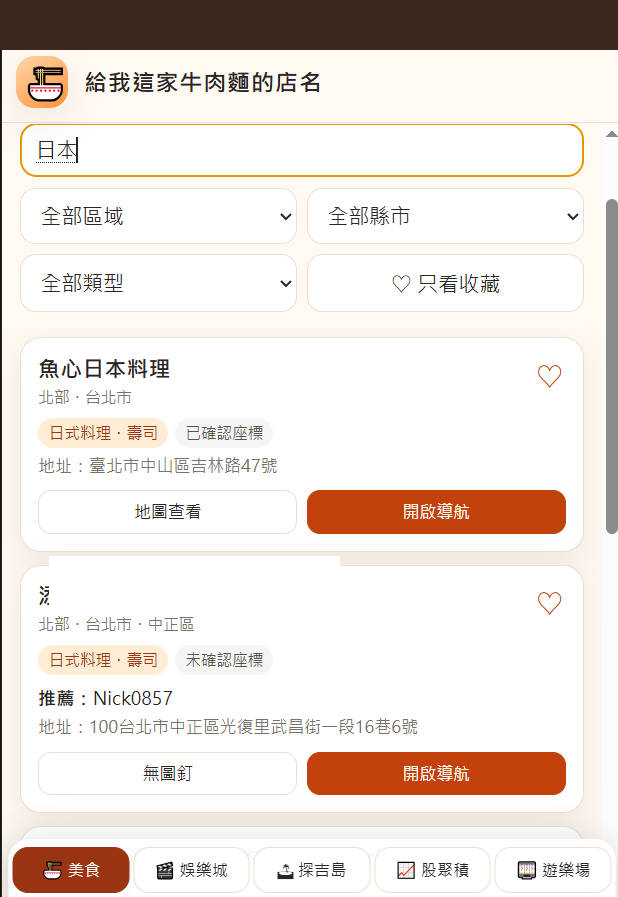

依關鍵字與縣市／類型篩選店家，可地圖查看與開啟導航；也能只看收藏。

#### 02　探吉島旅程：擲骰移動與用餐打卡
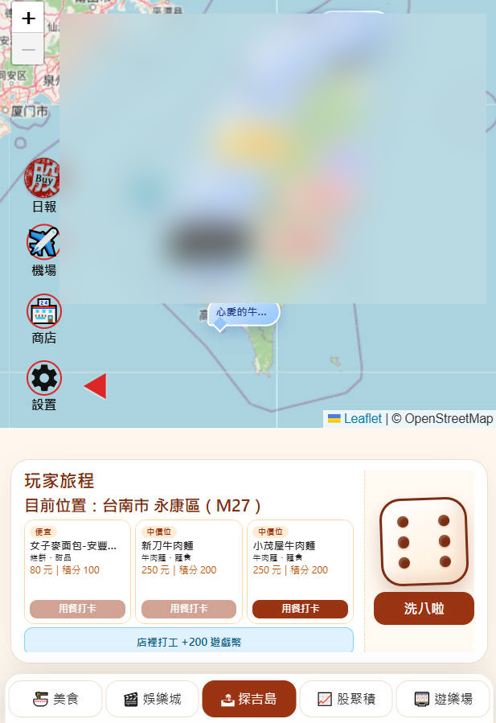

地圖即遊戲。點「洗八啦」擲骰前進，抵達後選擇本區餐廳「用餐打卡」，或店裡打工賺遊戲幣。

#### 03　探吉島機場（澎湖／福岡）
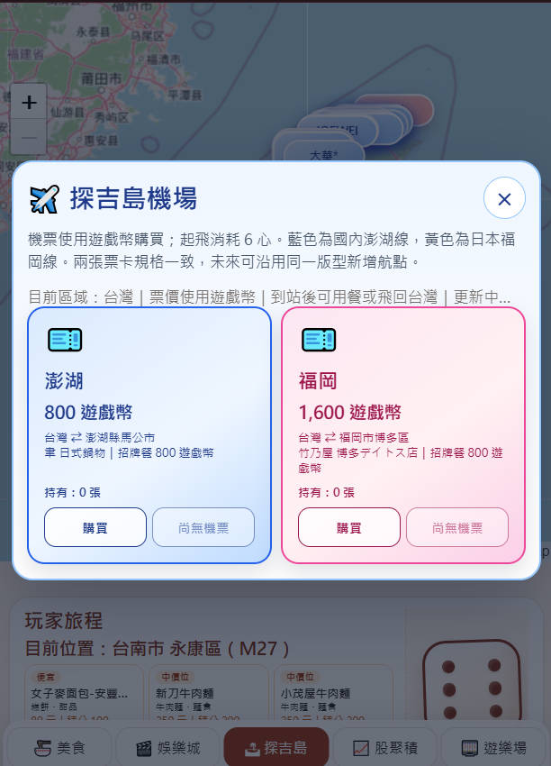

用遊戲幣購買機票，起飛消耗體力；可飛澎湖或福岡支線，抵達後用餐或飛回台灣。

#### 04　積分商店與永久收藏
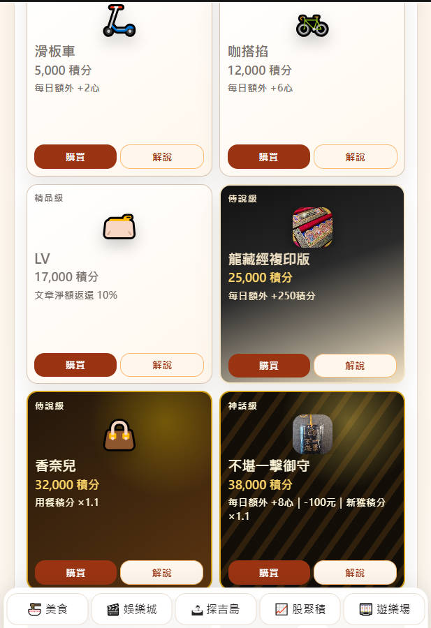

以積分購買滑板車、皮夾、香奈兒包等收藏；持有即發動每日加成或積分倍率，不必再按使用。

#### 05　我的美食卡與伴手禮收藏
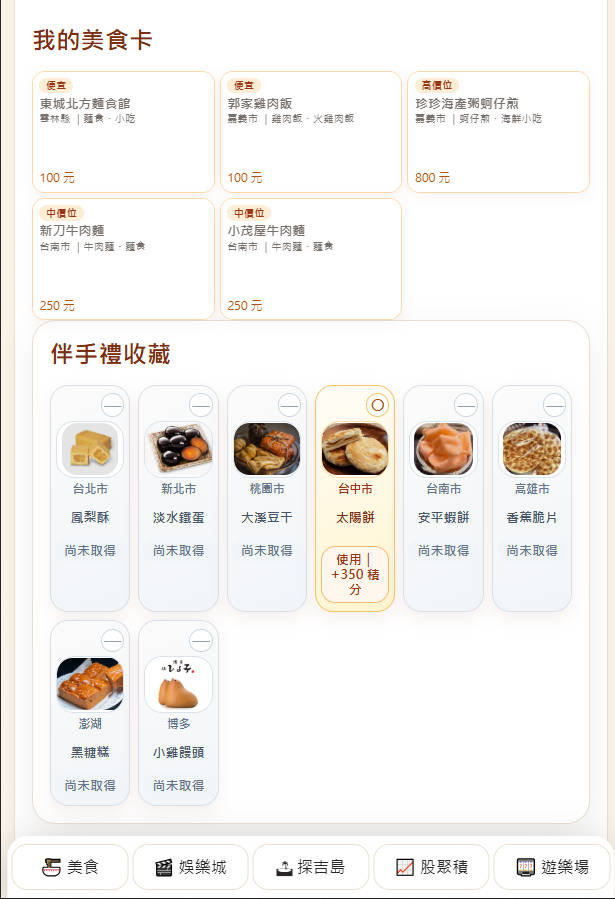

用餐累積美食卡；走訪城市可收集伴手禮（如太陽餅、黑糖糕、小雞饅頭）並兌換積分。

#### 06　娛樂城：影音動漫與亂數推薦
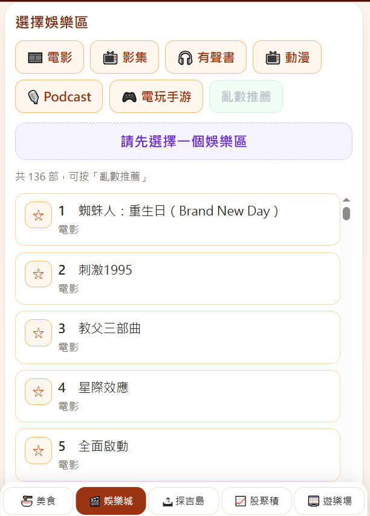

電影、影集、有聲書、動漫、Podcast、電玩手游分區瀏覽，也可亂數推薦休息恢復體力。

#### 07　遊樂場：釣魚／高爾夫／打地鼠
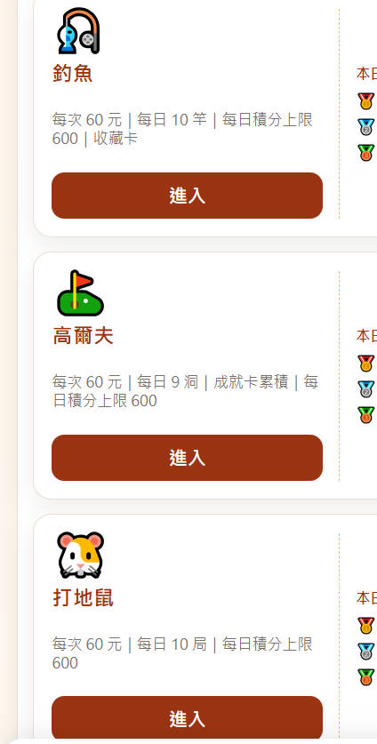

每次消耗遊戲幣挑戰小遊戲，每日有次數與積分上限，可累積收藏／成就。

#### 08　股聚積：申購與持股
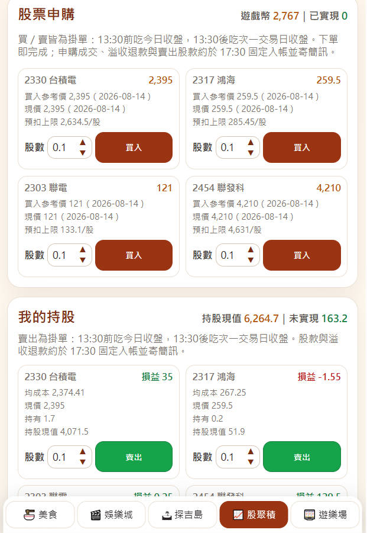

用遊戲幣申購台股標的、管理持股與未實現損益；收盤價依下單時點規則結算。

#### 09　大神文章聚集
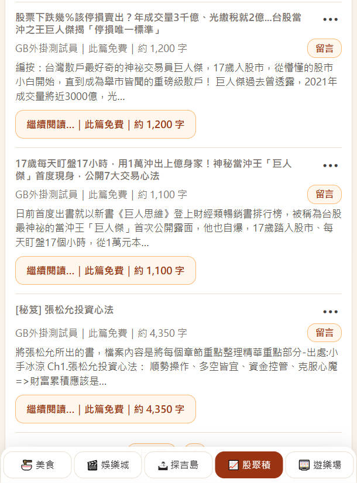

閱讀投資心法與講座整理，可留言與繼續閱讀；付費文可用積分或遊戲幣解鎖。

#### 10　股 Buy 日報（轉強買超／資券）
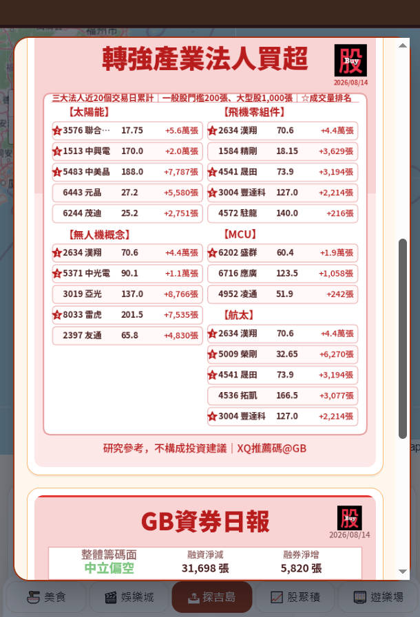

遊戲內一鍵開啟當日轉強產業法人買超與 GB 資券日報卡片（僅供研究參考）。

---

## 台指期看盤介面（指標三件套）

一個資料夾打包：主圖戰情總覽 + 大戶攻擊力 + ADX。須綁定推薦碼 **`＠GB`**。

→ [台指期看盤介面](./台指期看盤介面/)

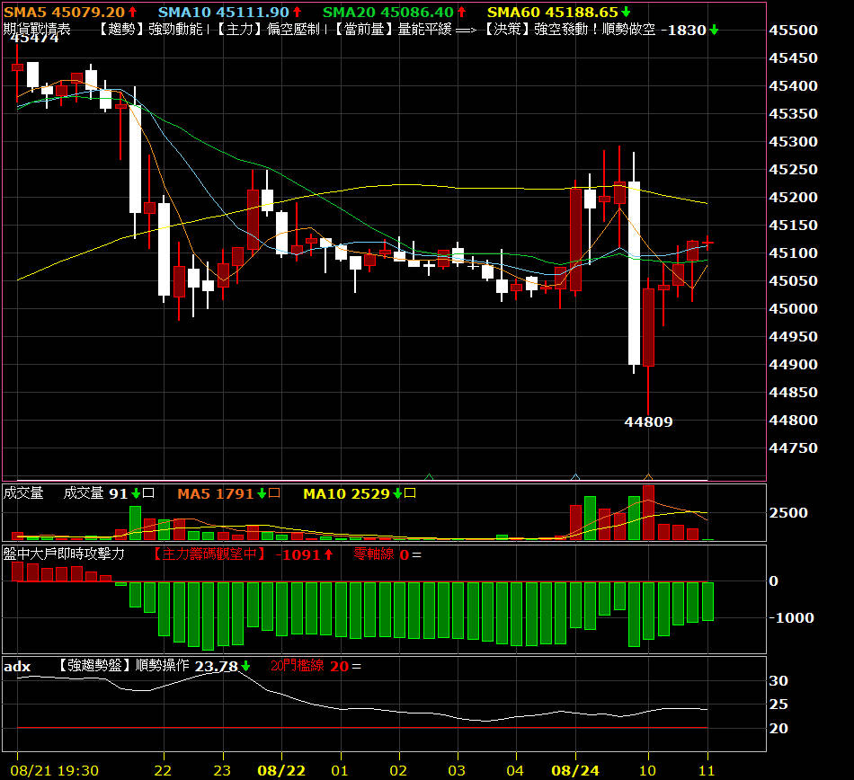

## 已發布腳本

### [台指期看盤介面](台指期看盤介面/)

台指期分 K 看盤介面三件套（**期貨戰情表 v1.1**、盤中大戶即時攻擊力、自訂_ADX）。建議在15分K週期使用。v1.1 已移除掛單欄位，改為趨勢／主力／量能 → 決策。

### [VCP 波動收縮選股 v1.0](VCP波動收縮選股_v1.0/)

用於篩選趨勢結構較強、近期價格波動逐步收斂，並伴隨量能變化的股票。

### [外資買進 v1.0](外資買進_v1.0/)

用於觀察外資在一段期間內的累計買賣超狀況，協助篩選外資資金較明顯流入的股票。

### [周轉率成交量 v1.0](周轉率成交量_v1.0/)

用於尋找市場熱度逐步升高、成交量同步放大的股票，協助篩選短線交易與當沖觀察標的。

### [底部轉機 v1.0](底部轉機_v1.0/)

用於尋找評價位置相對合理、財務結構具一定安全性，且近期出現營運或價格動能改善跡象的股票。

### [小資董事力挺 v1.0](小資董事力挺_v1.0/)

用於尋找股價較容易參與，且近期董監持股出現增加跡象的股票，作為內部人信心觀察工具。

### [長波段選股 v1.0](長波段選股_v1.0/)

結合中長期趨勢、成交量與法人籌碼方向，協助尋找具備長波段發展潛力的股票。

### [法人同步 v1.0](法人同步_v1.0/)

用於觀察外資、投信與自營商在指定期間內是否呈現同步買超，協助找出法人資金方向較一致的股票。

### [真雲鳳凰 v1.0](./真雲鳳凰_v1.0)

免費公開下載的多軍集合資料，主題為「一路做多」，不需綁定推薦碼。
