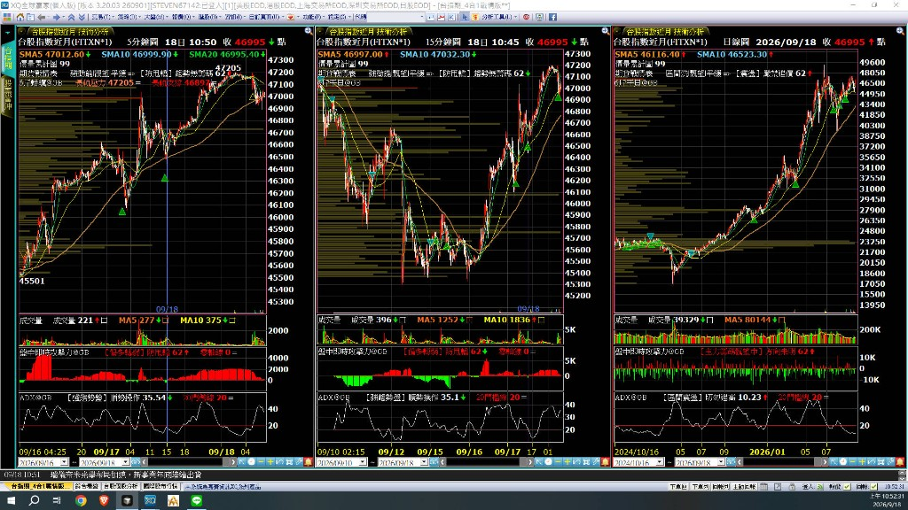

# 六斤干貝／六斤蛤蜊

> [!IMPORTANT]
> 需綁定 XQ 推薦碼 **＠GB** 才能執行腳本。

主圖訊號兩件套：

| 指標 | 建議週期 | 用途 |
|------|----------|------|
| **六斤蛤蜊** | **短線 5 分 K** | 短進短出、當日節奏 |
| **六斤干貝** | **大波段 15 分 K／日 K** | 中長線波段、趨勢回測 |

示意：左 5K（蛤蜊）／中 15K（干貝）／右日 K（干貝）。訊號為上下三角形（多軍／空軍）。

## 內含檔案

| 檔案 | 用途 |
|------|------|
| `六斤蛤蜊_5K_v1.0_推薦碼GB.xsb` | 主圖：短線 5K 多空軍訊號 |
| `六斤干貝_15分K日K_v1.0_推薦碼GB.xsb` | 主圖：大波段 15K／日 K 多空軍訊號 |
| `六斤干貝蛤蜊_demo.png` | 同框示範圖 |

## 安裝方式

1. 下載兩個 `.xsb`
2. XQ → XScript 編輯器 → **匯入**
3. 開圖後掛上對應週期：
   - **5 分 K** → 掛「六斤蛤蜊」
   - **15 分 K／日 K** → 掛「六斤干貝」

## 指標怎麼設定（繪圖樣式）

訊號要顯示成上下三角形，請依下列步驟：

1. **主圖右鍵** → **設定**
2. **主圖指標** → 選「六斤蛤蜊」或「六斤干貝」
3. **繪圖樣式** → **多軍空軍訊號**
4. **型式**選 **點**
5. **樣式**選 **上下三角形**（或自訂義）
6. **完成**

## 使用權限

- 已綁定推薦碼 `＠GB` 可執行
- 未綁定無法執行
- 作者帳號可執行

## 免責聲明

僅供研究與教學，不構成投資建議。使用者應自行承擔風險。
