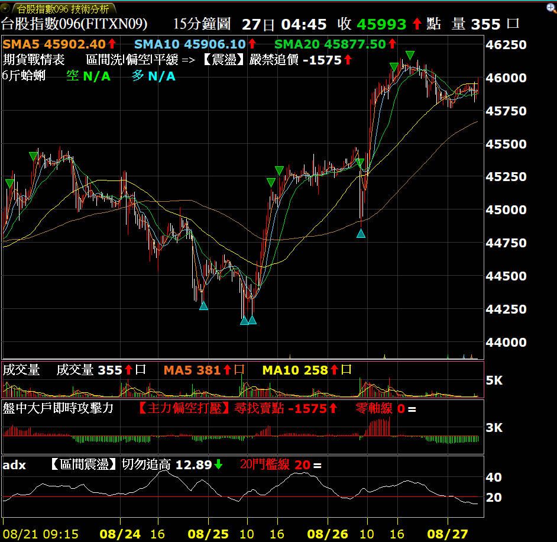
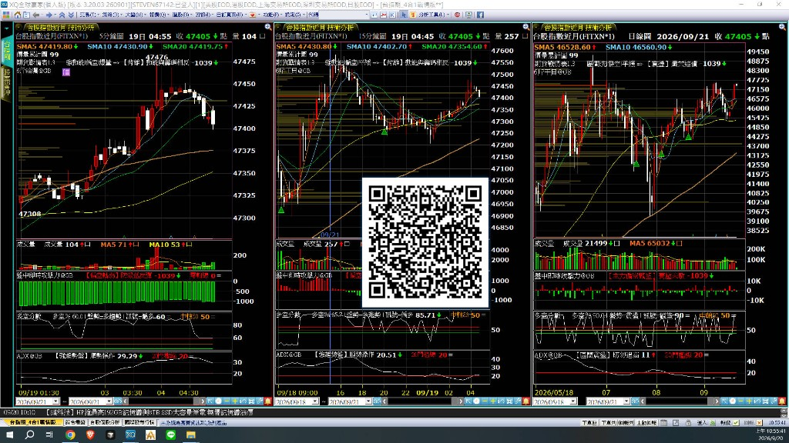
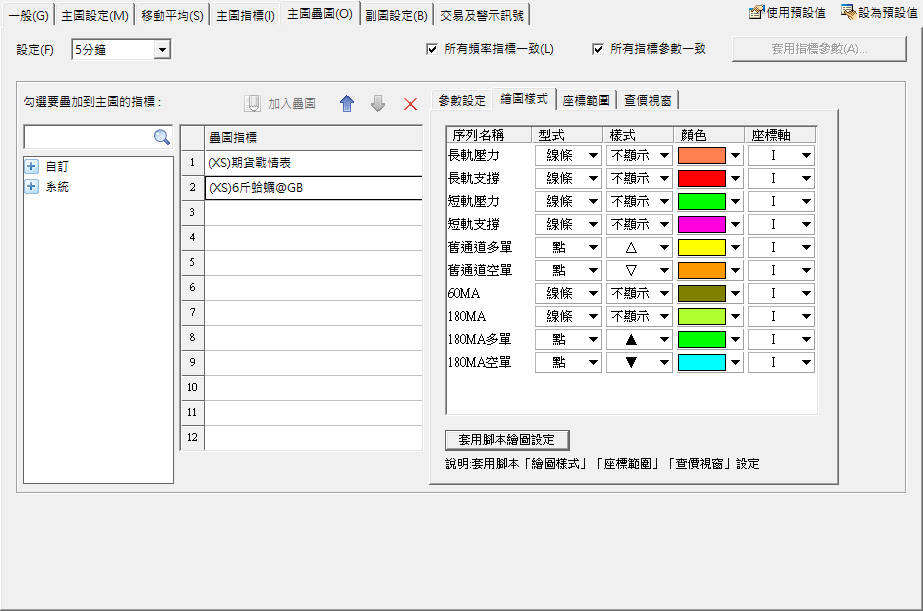

<!-- notice-layout:fullwidth-GB -->
# 台指期看盤介面

> [!IMPORTANT]
> 2. 其他指標：需綁定XQ推薦碼＠GB才能執行腳本。

台指期分 K「看盤介面」：**主圖疊圖**戰情表 ＋ **副圖**大戶攻擊力 ＋ **副圖**多空分數 ＋ **副圖**ADX，另附主圖訊號 **6斤蛤蜊／6斤干貝**。

> [!NOTE]
> **主圖（2026-09-20 更新）**：`期貨戰情表1.3.xsb`（趨勢／主力／量能 → 決策）  
> **副圖**：`盤中大戶即時攻擊力_v1.1.xsb`（±1500 攻堅／打壓；中間帶細分偏多／偏空觀望、轉弱、拉鋸）＋ `多空分數.xsb`（盤勢打分＋訊號）＋ `自訂_ADX_v1.0_推薦碼GB.xsb`  
> **主圖訊號（2026-09-18）**：`6斤蛤蜊`（短線 **5K**，通道／均線預設不顯示）＋ `6斤干貝`（大波段 **15K／日K**）

## 內含檔案

| 檔案 | 用途 |
|------|------|
| **`期貨戰情表1.3.xsb`** | **主圖疊圖**（**2026-09-20 更新檔**）：趨勢／主力／量能 → 決策（取代 V1.2 精簡大字版） |
| **`盤中大戶即時攻擊力_v1.1.xsb`** | **副圖**：內外盤淨攻擊力＋中間帶細分詞彙 |
| **`多空分數.xsb`** | **副圖指標**：多空%＋盤勢／訊號標籤（見下方說明） |
| `自訂_ADX_v1.0_推薦碼GB.xsb` | **副圖指標**：強趨勢 vs 區間震盪 |
| `6斤蛤蜊_5K_v1.0_推薦碼GB.xsb` | **主圖訊號**：短線 5 分 K 多空軍（通道／均線預設不顯示） |
| `6斤干貝_15分K日K_v1.0_推薦碼GB.xsb` | **主圖訊號**：大波段 15 分 K／日 K 多空軍 |
| `images/txo_battle_overview_demo_v2.png` | 戰情表同框示意圖 |
| `images/多空分數_demo.png` | 多空分數副圖示意（5K／15K／日K） |
| `images/6斤干貝蛤蜊_demo.png` | 蛤蜊／干貝示範圖（5K／15K／日K） |
| `images/6斤蛤蜊_繪圖設定.png` | 蛤蜊繪圖樣式設定說明（預設只顯示訊號三角） |

## 多空分數（副圖指標）

標籤會辨識盤勢並打分數，標題列可見：

- **盤勢**＝`震盪`／`區間`／`多趨勢`／`空趨勢`
- **訊號**＝`偏多`／`偏空`／`觀望`

同時顯示多空%（約 0～100），參考線常見於 20／50／80。

## 安裝方式

1. 下載戰情表 1.3、大戶攻擊力、多空分數、ADX，以及6斤蛤蜊／6斤干貝 `.xsb`
2. XQ → XScript 編輯器 → **匯入** `.xsb`
3. 開台指期分 K：
   - **主圖**掛「期貨戰情表 1.3」（疊圖）
   - **副圖**掛「大戶攻擊力」、「多空分數」與「ADX」
   - **短線 5K** 主圖加掛「6斤蛤蜊」
   - **大波段 15K／日K** 主圖加掛「6斤干貝」
4. **ADX 顯示柱圖步驟**：右鍵設定 → 副圖設定 → `自訂_ADX_v1.0` → 繪圖樣式 → Plot1 型式 → **柱圖** → 樣式 → **正負**

## 6斤蛤蜊／干貝：繪圖樣式設定

訊號要顯示成上下三角形：

1. **主圖右鍵** → **設定**
2. **主圖指標**／**主圖疊圖** → 選「6斤蛤蜊」或「6斤干貝」
3. **繪圖樣式** → **多軍空軍訊號**
4. **型式**選 **點**
5. **樣式**選 **上下三角形**（或自訂義）
6. **完成**

### 6斤蛤蜊預設顯示（期貨版）

匯入後預設：**長軌／短軌壓力支撐、60MA、180MA = 不顯示**；只留舊通道與 180MA 多空軍三角。若要看線，再於繪圖樣式改回顯示，或點「套用腳本繪圖設定」。

## 使用權限

- 已綁定推薦碼 `＠GB` 可執行
- 未綁定無法執行
- 作者帳號可執行

## ❓ 常見問題與除錯 (Troubleshooting)

### Q: 請問指標準嗎？

世界上並不存在準的指標，市場的未來走勢有著不可預測性。用在 15 分 K 的用意是可以看穿全市場的動態，至少不要跟市場做相反的方向。

### Q: 指標是用 15 分 K，其他週期可以嗎？

看你做的週期決定。短進短出可以用 5K 或 1K，但相對的容易被洗。如用 5K 就是 8:50 的收盤價出報告，15K 就是 9:00 收盤價出報告，1K 就是即時，依此類推。6斤蛤蜊建議 5K；6斤干貝建議 15K／日K。

## 免責聲明

僅供研究與教學，不構成投資建議。使用者應自行承擔風險。
