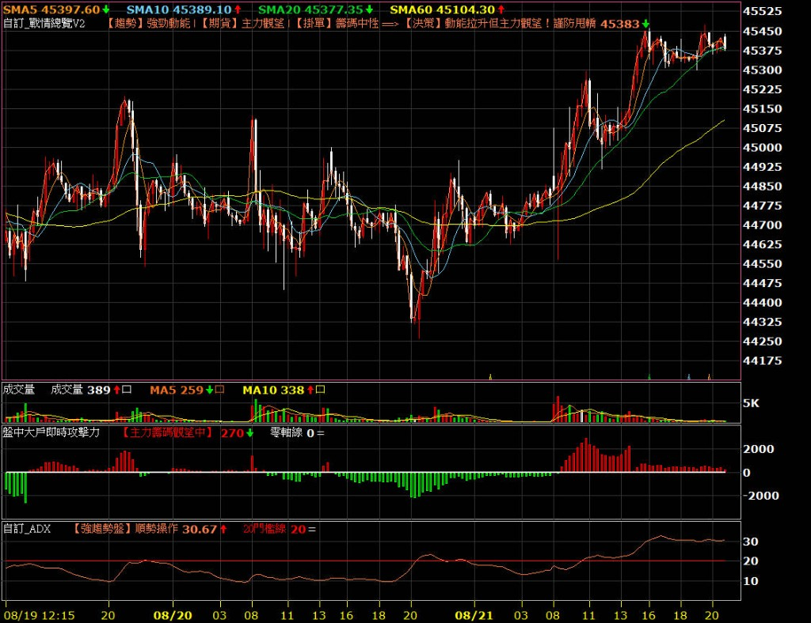

# 自訂_戰情總覽V2 v1.0

> [!IMPORTANT]
> 本腳本僅限已綁定 XQ 推薦碼 **`@GB`** 的使用者執行。

## 腳本介紹

主圖戰情總覽：整合 **ADX 趨勢**、**期貨主力淨攻擊力（內外盤）**、**委買／委賣掛單差**，輸出一句決策提示（強多／強空／防甩轎／禁追價）。

實際計算細節與門檻邏輯不公開。

## 功能特色

- 趨勢：強勁動能／區間震盪
- 期貨：主力偏多／偏空／觀望
- 掛單：買盤支撐／賣壓壓制／籌碼中性
- 決策分流文字直接顯示於主圖標籤

## 實戰示意（三指標同框）

建議與「盤中大戶即時攻擊力」「自訂_ADX」一併套用：

## 腳本下載

下載本資料夾內：

`自訂_戰情總覽V2_v1.0_推薦碼GB.xsb`

## 安裝方式

1. 下載 `.xsb` 檔案
2. 開啟 XQ 全球贏家 → XScript 編輯器 → **匯入**
3. 將指標加入**台指期**主圖（或分 K 圖）

## 使用權限

- 已綁定推薦碼 `@GB` 的帳號可以執行
- 未綁定推薦碼 `@GB` 的帳號無法執行
- 作者帳號可執行

## 版本資訊

- 版本：v1.0
- 類型：XQ 指標腳本
- 適用：台指期分 K／主圖戰情

## 免責聲明

本腳本僅供研究、資料分析及教學用途，不構成任何投資建議。使用者應自行判斷並承擔相關風險。
